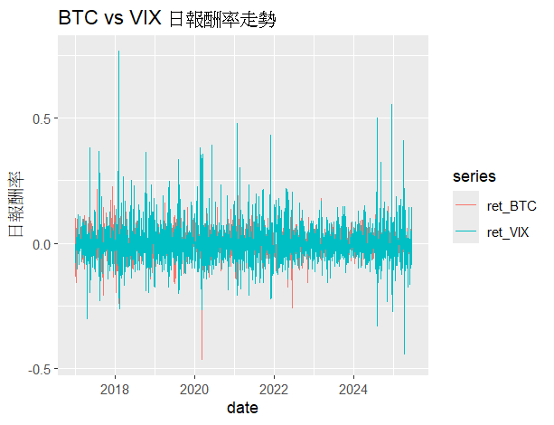

# 專案：比特幣與宏觀經濟指標關聯性之量化分析

這是一個使用R語言進行的量化分析專案，旨在探討比特幣(Bitcoin)與四個關鍵宏觀經濟指標（美元指數DXY、VIX指數、黃金、美國十年期公債殖利率）之間的動態關聯。

## 核心發現

本專案透過相關性分析、Granger因果檢定及多元線性迴歸，得出以下主要結論：

1.  **比特幣是明確的「風險性資產」**：其報酬率與市場恐慌指數(VIX)呈現顯著負相關。
2.  **宏觀因子具有解釋力**：VIX、美元指數及黃金為影響比特幣報酬率的顯著因子。
3.  **具備領先指標潛力**：比特幣的歷史報酬率能單向預測美債殖利率的未來變動。

---

## 分析結果視覺化

### **散佈圖與相關性分析 (Scatter Plots)**

#### 1. BTC vs VIX 報酬率散佈圖
下圖顯示了比特幣與VIX指數日報酬率的關係，可以看到清晰的負向趨勢，相關係數為-0.228。

#### 2. BTC vs DXY 報酬率散佈圖
下圖顯示了比特幣與美元指數的關係，呈現微弱的負相關，相關係數為-0.095。

#### 3. BTC vs GOLD 報酬率散佈圖
下圖顯示了比特幣與黃金的關係，呈現微弱的正相關，相關係數為0.092，為「數位黃金」的敘事提供部分支持。

#### 4. BTC vs US10Y 報酬率散佈圖
下圖顯示了比特幣與十年期美債殖利率的關係，兩者之間幾乎沒有線性關聯，相關係數為0.032。

---

### **時間序列走勢圖 (Time Series Plots)**

#### 1. BTC vs VIX 日報酬率走勢
下圖比較了比特幣與VIX指數的日報酬率波動。可以清晰看到在市場危機時（如2020年3月），VIX指數飆升，而比特幣價格則同時大幅下跌。

#### 2. BTC vs DXY 日報酬率走勢
下圖顯示比特幣的波動性遠大於美元指數的波動性。

#### 3. BTC vs GOLD 日報酬率走勢
下圖顯示比特幣的波動性同樣遠大於黃金。

#### 4. BTC vs US10Y 日報酬率走勢
下圖比較了比特幣與十年期美債殖利率的報酬率波動。

---

### **模型診斷圖 (Model Diagnostic Plots)**

#### 1. 殘差與擬合值圖 (Residuals vs Fitted)
下圖顯示殘差分佈隨機，沒有明顯的模式，表明模型的線性假設基本成立。

#### 2. 常態Q-Q圖 (Normal Q-Q Plot)
下圖顯示殘差分佈在兩端尾部偏離常態分佈，呈現金融數據中常見的「厚尾現象」。

---

### **Granger 因果檢定結果**

下圖為Granger因果檢定結果的摘要，其中最顯著的發現是比特幣的歷史報酬率能單向預測美國十年期公債殖利率的變動 (p < 0.01)。

---

## 專案結構與資源

* **/report.html**: 本專案的互動式網頁報告，提供最完整的分析體驗。
    * **[點此查看互動式報告](https://Howard-UH.github.io/bitcoin-report-cor/report.html)**
* **/correlation-1.R**: 主要的R語言分析腳本。
* **所有.png檔案**: 由R語言生成的視覺化圖表。
